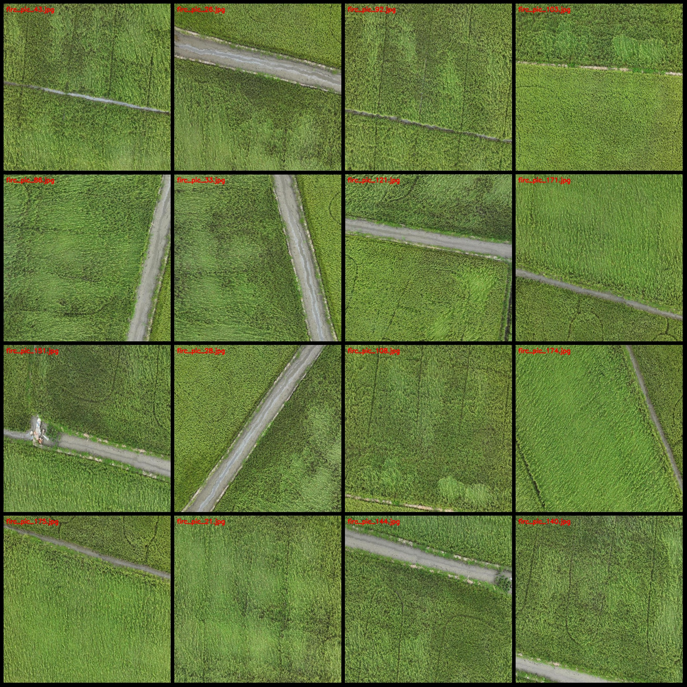
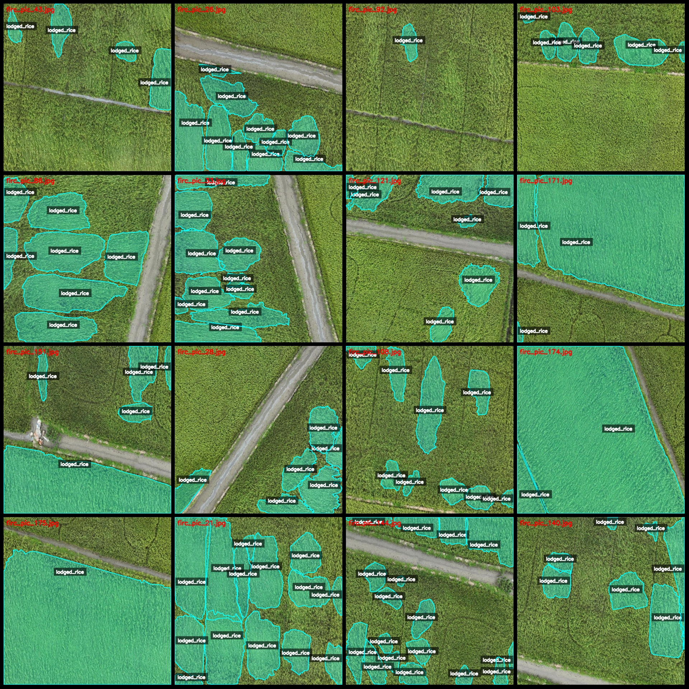
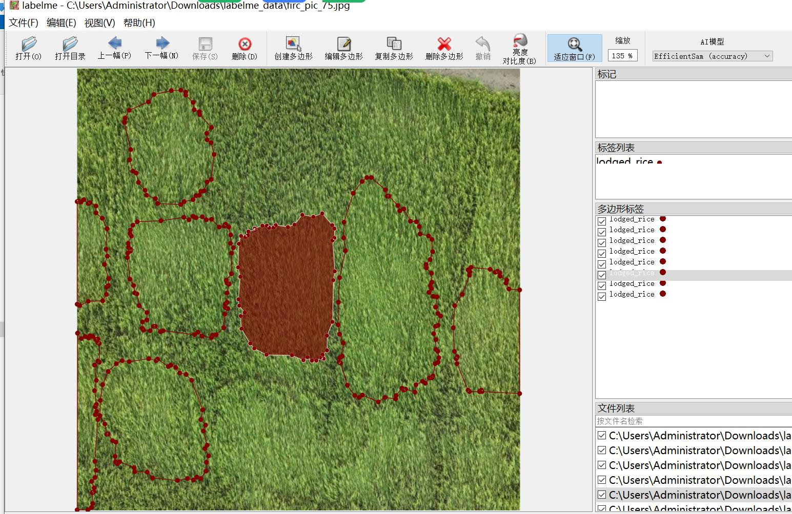

# UAV Perspective Rice Bending Recognition and Segmentation Dataset (labelme format)

**Dataset Format:** labelme format (excluding mask files, only containing JPG images and corresponding JSON files)

- **Number of Images (JPG Files Count):** 175
- **Number of Annotations (JSON Files Count):** 175
- **Number of Categories:** 1
- **Category Name:** "lodged_rice"
- **Number of Boxes per Category:** 1267
- **Total Boxes:** 1267
- **Labeling Tool:** labelme version 5.5.0
- **Image Resolution:** 640x640
- **Annotation Rules:** Polygons are drawn for each category
- **Special Notice:** The dataset can be edited using labelme, but the JSON dataset needs to be converted into either mask or yolo format or coco format for semantic segmentation or instance 
segmentation.
- **Disclaimer:** This dataset does not guarantee the accuracy of the trained models or weight files.

**Annotation Example:**
- **Original Image (Randomly selected 16 images):** [Insert sample image here]
- **Annotation Drawing Results:** [Insert annotation drawing results here]
- **Labelme Edit Image Example:** [Insert labelme editing example image here]

## Image

Here is a pay link on Stripe ( https://buy.stripe.com/3cs8yP7sY87d0vu9AB ). Please contact me lonlonago@foxmail.com after funding $89, and I will send you a complete data files , thank you!

